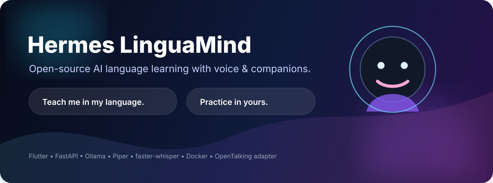
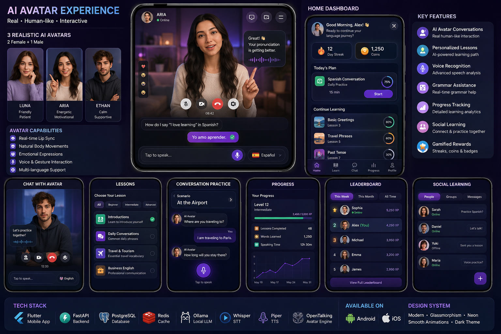
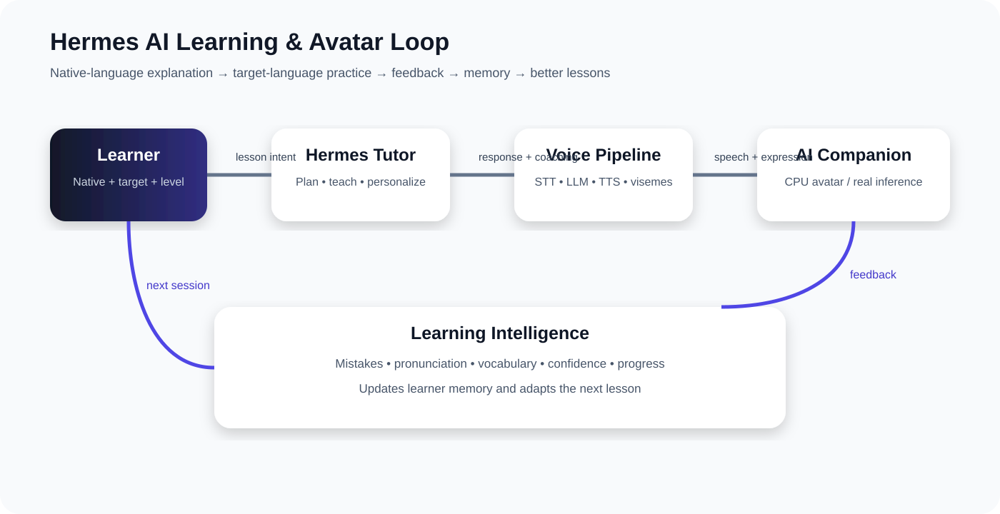
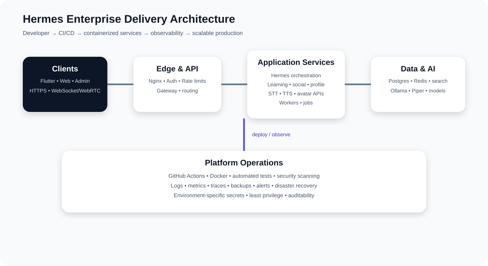
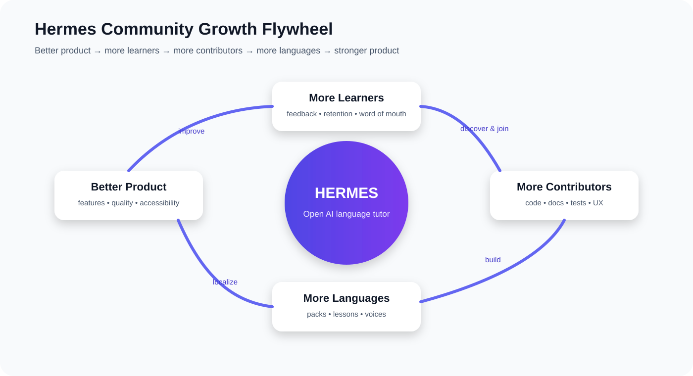

# Hermes LinguaMind

### Open-source AI language learning — built around conversation, voice, personalization, and companion experiences.


[](LICENSE)
[](https://flutter.dev/)
[](https://python.org/)
[](https://docker.com/)

> **Teach me in my language. Practice with me in yours.**

Hermes LinguaMind is a full-stack, open-source language-learning platform that combines an AI tutor, speech-to-text, local text-to-speech, personalized learning, pronunciation support, gamification, social learning, and an extensible avatar/companion layer.



### Product showcase



## 🗺️ Visual architecture

### AI learning + avatar loop



### Enterprise delivery architecture



### Community growth flywheel



## ✨ The product vision

A learner should be able to say:

> “I speak Urdu and I want to learn English.”

…and Hermes should understand the learner's level, explain difficult concepts in the learner's native language, switch into the target language for practice, listen to spoken answers, correct mistakes, track progress, and make the experience feel like a personal tutor rather than a static course.

### The core loop

```text
Native language + target language + level
                    │
                    ▼
             Hermes AI Tutor
                    │
       ┌────────────┼────────────┐
       ▼            ▼            ▼
     Lesson       Voice       Companion
       │            │            │
       └────────────┼────────────┘
                    ▼
          Practice → Feedback
                    │
                    ▼
             Progress + Memory
```

## 🧩 What is included

| Area | Included in repository |
|---|---|
| 📱 Mobile | Flutter app with auth, onboarding, companion, learning, profile, social, leaderboard and settings |
| 🧠 AI | LLM orchestration + Hermes orchestrator with intent/planning/verification layers |
| 🎙️ STT | Self-hosted `faster-whisper` path |
| 🔊 TTS | Self-hosted Piper voice path + provider fallback hooks |
| 👄 Lip-sync | Viseme generation/timeline plumbing |
| 🎭 Avatar | Companion renderer + WebRTC integration hooks + optional OpenTalking integration |
| 📚 Learning | Curriculum, lessons, personalization, grammar and pronunciation services |
| 🪙 Gamification | Coins, leaderboard and progress flows |
| 🤝 Social | Social exchange/matching/reporting service layer |
| 🔐 Security | Auth, rate limiting hooks, moderation, security service and secret-safe configuration patterns |
| 🐳 Infrastructure | Docker Compose, PostgreSQL, Redis, Elasticsearch, Ollama and Nginx |
| ☸️ Scale path | Kubernetes manifests and production architecture documentation |
| 🧪 Quality | Backend unit/integration tests, repository doctor, CI scaffolding |

## ⚠️ Honest status

This repository is a **professional release-candidate foundation**, not a claim that every deployment is production-certified. The original project contains a large multi-service stack; runtime validation depends on your machine, Docker/WSL availability, model downloads, device permissions, and optional third-party credentials.

Most importantly: **the avatar layer is designed to support real inference, but the repository does not bundle proprietary or GPU-heavy avatar model weights.** The default avatar path can run without those weights; real OpenTalking inference must be provisioned separately and licensed appropriately.

## 🚀 Quick start

### Prerequisites

- Docker Engine + Docker Compose v2
- Git
- 8–16 GB RAM recommended for the lightweight development stack
- For mobile: Flutter 3.35+ and Android Studio/Xcode as appropriate
- Optional GPU for heavier local models/avatar inference

### 1. Clone

```bash
git clone https://github.com/mehmood3020932/HermesLinguaMind.git
cd hermes-linguamind
```

### 2. Configure secrets

```bash
cp backend/.env.example backend/.env
```

Edit `backend/.env`. **Never commit the resulting `.env`.**

### 3. Start the backend

```bash
make setup
make up
```

Or directly:

```bash
cd backend
docker compose up --build
```

### 4. Start the Flutter app

```bash
cd mobile_app
flutter pub get
flutter run --dart-define=API_BASE_URL=http://10.0.2.2:8080
```

For a physical phone, replace `10.0.2.2` with the LAN address of the machine running the backend.

### 5. Run repository checks

```bash
make doctor
make test
```

## 🏗️ Repository architecture

```text
hermes-linguamind/
├── backend/
│   ├── gateway/                    # Public API gateway
│   ├── phase3/services/            # Core production service implementations
│   ├── phase3/shared/              # Shared backend models/auth/db helpers
│   ├── phase4/services/             # Hermes orchestration layer
│   ├── phase4/tests/                # Orchestrator tests
│   ├── scripts/                     # Voice/avatar/bootstrap helpers
│   ├── docker/                      # Backend/nginx images + process supervision
│   ├── k8s/                         # Deployment assets / scale path
│   ├── docker-compose.yml           # Local all-in-one stack
│   └── .env.example                 # Safe configuration template
├── mobile_app/
│   ├── lib/core/                    # Theme, constants, shared services/widgets
│   ├── lib/data/                    # API clients, adapters, models, repositories
│   └── lib/features/                # Auth, home, companion, learning, social, etc.
├── docs/                            # Product, architecture, operations and contributor docs
├── scripts/                         # Root-level developer tooling
├── .github/                         # CI, issue templates and project governance
├── Makefile                         # One-command developer workflow
└── LICENSE
```

## 🎭 Avatar strategy

Hermes treats the avatar as a pluggable presentation layer rather than hard-coding one vendor.

```text
STT → Hermes AI → TTS → Visemes/Emotion
                         │
             ┌───────────┴───────────┐
             ▼                       ▼
       2D/CPU companion        OpenTalking/WebRTC
       (lightweight)            (optional real inference)
             │                       │
             └───────────┬───────────┘
                         ▼
                    Flutter UI
```

See [`docs/AVATARS.md`](docs/AVATARS.md) for the production path, model/licensing rules, CPU-first fallback, and how to provision real inference.

## 🌍 Language strategy

The architecture separates:

- native/explanation language
- learning/target language
- UI language
- STT language
- TTS voice
- lesson/curriculum language pack

The current Compose configuration ships a small Piper voice set for the starter experience. Expanding language coverage is intentionally designed as a community-friendly contribution path. See [`docs/LANGUAGES.md`](docs/LANGUAGES.md).

## 🛡️ Security principles

- Secrets stay in `.env` or a deployment secret manager.
- No API keys belong in source control.
- Production deployments must use HTTPS and a real domain.
- Restrict CORS to trusted origins.
- Rotate JWT/application secrets before public deployment.
- Do not expose PostgreSQL, Redis or Elasticsearch directly to the public internet.
- Review third-party model/voice/avatar licenses before redistribution or commercial use.

See [`SECURITY.md`](SECURITY.md) and [`docs/PRODUCTION.md`](docs/PRODUCTION.md).

## 🤝 Contributing

Hermes is intended to become a community project. Start with [`CONTRIBUTING.md`](CONTRIBUTING.md), then look for issues tagged `good first issue`, `help wanted`, or a language-specific label.

Good contribution areas:

- language packs and lesson content
- Flutter UX/accessibility
- pronunciation scoring
- STT/TTS integrations
- avatar/viseme systems
- backend services
- tests and CI
- documentation and translations
- deployment/Kubernetes

## 🗺️ Roadmap

See [`ROADMAP.md`](ROADMAP.md). The long-term goal is a privacy-conscious, open-source AI tutor that can teach through native-language explanations and natural target-language conversation across many languages and devices.

## 📊 Project philosophy

**Open source does not mean careless.** Hermes aims for transparent architecture, reproducible development, explicit licensing, secure defaults, honest capability claims, and a contributor experience that can scale from a solo prototype to a serious community project.

## 📜 License

Original Hermes LinguaMind code is released under the MIT License. Third-party dependencies, model weights, voices, fonts, and upstream projects retain their own licenses; see their respective files and documentation before redistribution.

## 🚀 Public-launch positioning

Hermes is designed to earn trust before hype. The public repository should make the first experience exceptional while keeping capability claims honest.

**Best first demo:** `Urdu speaker → English learner → voice conversation → one useful correction → retry → progress saved.`

Launch assets and operating playbooks:

- [`docs/DEMO_SCRIPT.md`](docs/DEMO_SCRIPT.md) — 90-second product demo
- [`docs/GROWTH_PLAYBOOK.md`](docs/GROWTH_PLAYBOOK.md) — ethical user/community growth
- [`docs/LAUNCH_CHECKLIST.md`](docs/LAUNCH_CHECKLIST.md) — public release gate
- [`docs/INVESTOR_ONE_PAGER.md`](docs/INVESTOR_ONE_PAGER.md) — investor narrative
- [`docs/investor/PITCH_DECK.md`](docs/investor/PITCH_DECK.md) — pitch deck outline
- [`website/index.html`](website/index.html) — deployable landing page

### What “wow” means in Hermes

A first-time learner should reach a meaningful speaking interaction quickly, hear the tutor explain difficult material in their chosen explanation language, practice in the target language, receive a specific correction, and see that correction influence the next turn. The avatar is an enhancement—not a substitute for a good tutor loop.

## 🌐 Production website

Hermes now includes a full responsive web experience served by the same Nginx public entry point as the API. It is not a separate mock frontend: the live tutor panel calls the real gateway, reads health/service status, and surfaces backend failures honestly.

- Website source: [`website/`](website/)
- Production-served frontend: [`backend/frontend/`](backend/frontend/)
- Web deployment architecture: [`docs/WEB_PRODUCTION.md`](docs/WEB_PRODUCTION.md)
- Live API docs when the stack is running: `/docs`
- Live gateway health: `/health`
- Live service registry: `/v1/services`
- Live tutor endpoint: `POST /v1/chat`

---

# ✦ The Hermes Vision

> **Learn the language you want — through the language you already understand.**

Hermes LinguaMind is designed around a simple idea: language learning should feel like having a patient, multilingual companion rather than navigating a pile of isolated exercises.

### Ultra product map

<p align="center">
  
</p>

### Built for the whole journey

| ✦ Learn | ✦ Speak | ✦ Personalize | ✦ Contribute |
|---|---|---|---|
| Native-language explanations | Voice-first practice | Memory + progress | Language packs |
| Structured lessons | Pronunciation feedback | Adaptive sessions | Code + docs |
| Grammar in context | AI role-play | Companion profiles | Sponsors |

### Community-powered growth

<p align="center">
  
</p>

### Enterprise delivery

<p align="center">
  
</p>

---

## 💚 Support the mission

If Hermes helps you or you believe in open, multilingual education, your support can help keep the project moving.

**→ [Sponsor Hermes](.github/FUNDING.yml)**  
**→ [Crypto donation options](docs/DONATIONS.md)**  
**→ [How sponsorship is used](docs/SPONSORING.md)**

> **Important:** Replace the BTC and USDT placeholders in `docs/DONATIONS.md` with your own verified public receiving addresses before publishing them.

---

## 🌟 Help build the next generation of language learning

**Developers:** build features.  
**Language experts:** add language packs.  
**Designers:** improve the experience.  
**Researchers:** improve evaluation.  
**Educators:** shape lesson quality.  
**Sponsors:** help fund the infrastructure.

**Start here:** [`CONTRIBUTING.md`](CONTRIBUTING.md)


## 🌍 Contributors

We welcome contributors from around the world! See [CONTRIBUTING.md](CONTRIBUTING.md) to get started.

<a href="https://github.com/mehmood3020932/HermesLinguaMind/graphs/contributors">
  
</a>

Made with [contrib.rocks](https://contrib.rocks).
