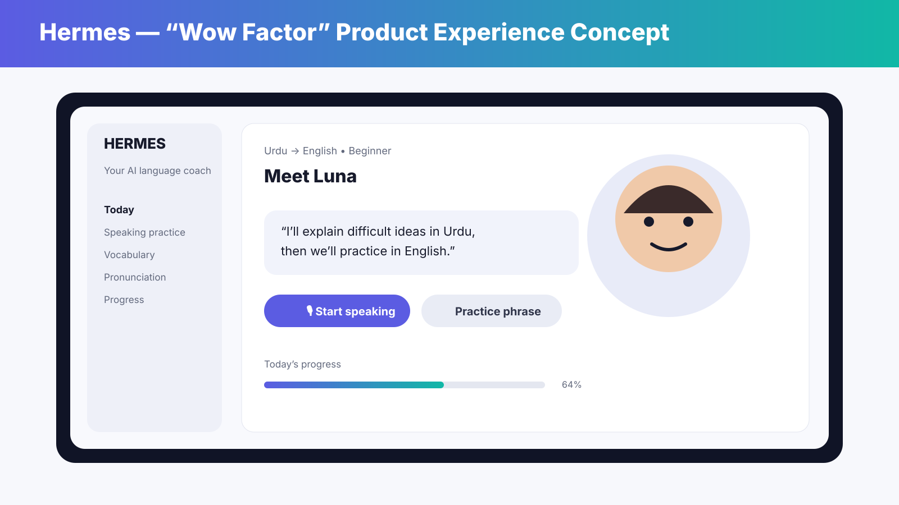
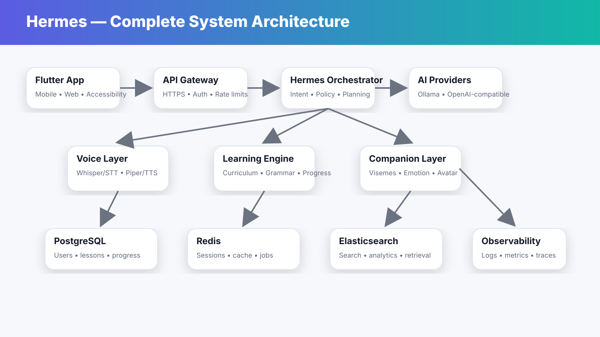

# Hermes Documentation Hub

Hermes is designed as a product, an open-source platform, and an extensible AI tutor ecosystem. This hub is the source of truth for architecture, product behavior, operations, security, and community contribution.

## Start here

- [Architecture](ARCHITECTURE.md) — system boundaries and runtime topology
- [Product](PRODUCT.md) — product promise and core learning loop
- [Avatar Architecture](AVATARS.md) — CPU-first and real inference paths
- [Languages](LANGUAGES.md) — native/target language model and voice routing
- [Production](PRODUCTION.md) — deployment and hardening checklist
- [Security](../SECURITY.md) — security policy and reporting
- [Contribution Guide](../CONTRIBUTING.md) — how to contribute

## Enterprise-grade design docs

- [Complete Architecture](engineering/COMPLETE_ARCHITECTURE.md)
- [API Contract](engineering/API_CONTRACT.md)
- [Data Model](engineering/DATA_MODEL.md)
- [Observability & SLOs](operations/OBSERVABILITY.md)
- [Threat Model](operations/THREAT_MODEL.md)
- [Privacy & Data Governance](operations/DATA_GOVERNANCE.md)
- [AI Evaluation](engineering/AI_EVALUATION.md)
- [Scalability](engineering/SCALABILITY.md)
- [Release & Rollback](operations/RELEASE_RUNBOOK.md)
- [Disaster Recovery](operations/DISASTER_RECOVERY.md)
- [ADR index](adr/README.md)

## Product visuals

